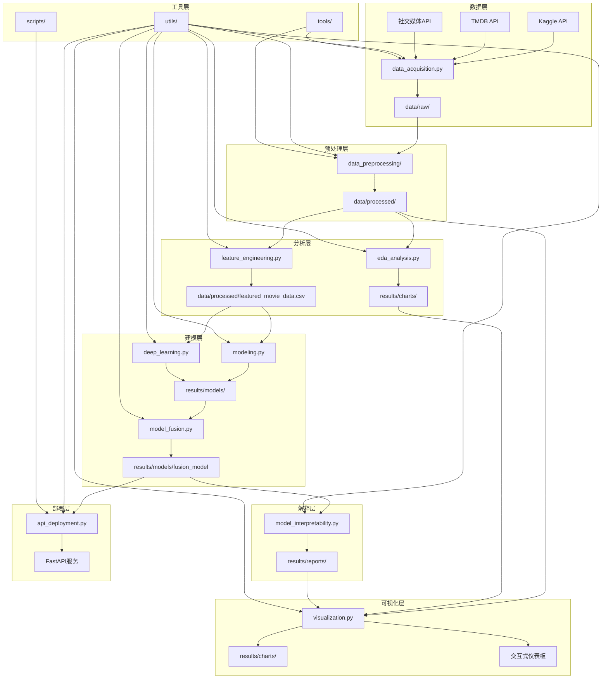

# 电影票房分析项目

## 项目概述

本项目旨在通过对电影数据的深入分析，揭示影响电影票房的关键因素，并建立高精度的票房预测模型。项目包含完整的数据获取、预处理、分析、建模和可视化流程，支持大规模数据处理和并行计算，适合电影产业分析和票房预测研究。

项目采用模块化设计，支持多种数据源、多种模型和多种可视化方式，具备高性能、高可扩展性和良好的可维护性。

## 项目特点

1. **完整的数据分析流程**：包含数据获取、预处理、探索性分析、特征工程、建模和可视化的完整流程
2. **大规模数据处理支持**：集成Dask进行并行计算，支持处理海量电影数据
3. **高性能设计**：包含性能监控、检查点机制和内存优化，提高处理效率
4. **多种模型支持**：支持传统机器学习模型和深度学习模型，包含模型融合功能
5. **高级特征工程**：支持文本分析、BERT特征提取、智能特征选择等高级功能
6. **完善的可视化**：提供基础可视化、交互式可视化和Dash仪表板
7. **模型可解释性**：支持SHAP值分析等模型解释方法
8. **API部署支持**：提供FastAPI部署脚本，便于实际应用
9. **详细的文档**：包含项目说明文档和操作手册

## 项目结构

```
movie_box_office_analysis/
├── config/                 # 配置文件目录
├── data/                   # 数据目录
│   ├── processed/          # 处理后的数据
│   └── raw/                # 原始数据
├── logs/                   # 日志文件目录
├── notebooks/              # Jupyter笔记本目录
├── results/                # 结果目录
│   ├── charts/             # 图表文件
│   ├── models/             # 训练好的模型
│   └── reports/            # 报告文件
├── src/                    # 源代码目录
│   ├── data/               # 数据子目录
│   ├── data_preprocessing/ # 数据预处理子模块
│   ├── scripts/            # 辅助脚本目录
│   ├── tools/              # 工具脚本目录
│   ├── utils/              # 通用工具目录
│   ├── data_acquisition.py # 数据获取脚本
│   ├── deep_learning.py    # 深度学习模型脚本
│   ├── eda_analysis.py     # 探索性数据分析脚本
│   ├── feature_engineering.py # 特征工程脚本
│   ├── modeling.py         # 传统机器学习模型脚本
│   ├── model_fusion.py     # 模型融合脚本
│   ├── model_interpretability.py # 模型可解释性脚本
│   ├── social_media_analysis.py # 社交媒体分析脚本
│   ├── text_analysis.py    # 文本分析脚本
│   ├── transformer_features.py # Transformer特征提取脚本
│   └── visualization.py    # 可视化脚本
├── tests/                  # 测试目录
├── LATEST_DATA_GUIDE.md    # 最新数据指南
├── README.md               # 项目说明文档
├── operation_manual.md     # 操作手册
└── requirements.txt        # 依赖包列表
```

## 项目架构图



## 详细目录说明

### 1. 根目录文件

| 文件名 | 描述 |
|--------|------|
| `.editorconfig` | 编辑器配置文件，确保代码风格一致性 |
| `.flake8` | Flake8代码检查配置文件 |
| `.gitignore` | Git忽略文件配置 |
| `.pylintrc` | Pylint代码质量检查配置文件 |
| `check_fixed_notebook.py` | 检查修复后的笔记本的脚本 |
| `LATEST_DATA_GUIDE.md` | 最新数据指南，包含数据字段说明和更新日志 |
| `main.py` | 项目主入口脚本，协调各个模块的执行 |
| `modeling_recovered.py` | 恢复的建模脚本 |
| `operation_manual.md` | 详细的操作手册，包含环境搭建和使用指南 |
| `README.md` | 项目说明文档，包含项目概述、特点和结构 |
| `requirements.txt` | 项目依赖包列表 |

### 2. 配置文件目录 (config/)

存放项目的配置文件，包括数据路径配置、模型参数配置、日志配置等。所有配置文件均使用YAML格式，便于修改和维护。

### 3. 数据目录 (data/)

- **data/raw/**：存放原始数据，包括从各种数据源获取的未处理数据。
- **data/processed/**：存放处理后的数据，包括清洗、转换和特征提取后的数据，用于模型训练和分析。

### 4. 日志目录 (logs/)

存放项目运行过程中生成的日志文件，包含各个模块的运行日志、错误信息和性能指标。日志文件按日期和模块分类，便于查找和分析。

### 5. Jupyter笔记本目录 (notebooks/)

存放项目相关的Jupyter笔记本，包括数据探索、模型训练、结果可视化等交互式分析文档。笔记本按功能和阶段分类，便于逐步学习和使用。

### 6. 结果目录 (results/)

- **results/charts/**：存放生成的图表文件，包括静态图表和交互式图表，用于结果展示和报告生成。
- **results/models/**：存放训练好的模型文件，包括传统机器学习模型和深度学习模型，支持模型加载和部署。
- **results/reports/**：存放生成的报告文件，包括分析报告、模型评估报告和项目总结报告。

### 7. 源代码目录 (src/)

#### 7.1 数据子目录 (src/data/)

存放数据相关的资源文件和临时数据，包括processed子目录用于存储处理过程中的中间数据。

#### 7.2 数据预处理子模块 (src/data_preprocessing/)

| 文件名 | 描述 |
|--------|------|
| `data_cleaner.py` | 数据清洗模块，负责处理数据中的错误、重复值和不一致性 |
| `data_loader.py` | 数据加载模块，负责从各种数据源加载数据 |
| `feature_extractor.py` | 特征提取模块，负责从原始数据中提取有用的特征 |
| `missing_value_handler.py` | 缺失值处理模块，负责处理数据中的缺失值 |
| `outlier_detector.py` | 异常值检测模块，负责检测和处理数据中的异常值 |
| `__init__.py` | 模块初始化文件，定义数据预处理的主要接口 |

#### 7.3 辅助脚本目录 (src/scripts/)

| 文件名 | 描述 |
|--------|------|
| `api_deployment.py` | API部署脚本，用于部署模型预测API |
| `check_fixed_notebook.py` | 检查修复后的笔记本的脚本 |
| `check_notebook.py` | 检查单个笔记本的脚本 |
| `check_notebooks.py` | 检查多个笔记本的脚本 |
| `check_text_fields.py` | 检查文本字段的脚本 |
| `clean_whitespace.py` | 清理空白字符的脚本 |
| `delete_old_files.py` | 删除旧文件的脚本 |
| `empty_results_folder.py` | 清空结果文件夹的脚本 |
| `merge_tmdb_data.py` | 合并TMDB数据的脚本 |
| `remove_trailing_whitespace.py` | 移除尾部空白字符的脚本 |
| `verify_update.py` | 验证更新的脚本 |

#### 7.4 工具脚本目录 (src/tools/)

主要用于处理Jupyter笔记本的工具脚本：

| 文件名 | 描述 |
|--------|------|
| `batch_fix_notebooks.py` | 批量修复笔记本的脚本 |
| `check_notebooks_json.py` | 检查笔记本JSON格式的脚本 |
| `check_notebooks_nbformat.py` | 检查笔记本nbformat格式的脚本 |
| `check_notebook_strings.py` | 检查笔记本字符串的脚本 |
| `create_fixed_notebook.py` | 创建修复后的笔记本的脚本 |
| `create_valid_notebook.py` | 创建有效笔记本的脚本 |
| `fix_notebooks.py` | 修复笔记本的脚本 |
| `fix_notebooks_with_nbformat.py` | 使用nbformat修复笔记本的脚本 |
| `fix_notebook_array_commas.py` | 修复笔记本数组逗号的脚本 |
| `fix_notebook_newlines.py` | 修复笔记本换行符的脚本 |
| `manual_fix_notebook.py` | 手动修复笔记本的脚本 |
| `powerful_fix_notebook.py` | 强大的笔记本修复脚本 |
| `simple_fix_json.py` | 简单修复JSON的脚本 |
| `simple_fix_notebooks.py` | 简单修复笔记本的脚本 |
| `super_simple_fix.py` | 超级简单的修复脚本 |
| `validate_notebooks.py` | 验证笔记本的脚本 |

#### 7.5 通用工具目录 (src/utils/)

存放项目通用的工具函数和类，包括日志工具、配置工具、性能监控工具等。

### 8. 核心功能模块

#### 8.1 数据获取模块 (src/data_acquisition.py)

负责从各种数据源获取电影相关数据，包括：
- 从Kaggle API获取公开电影数据集
- 从TMDB API获取最新电影数据
- 从社交媒体平台获取电影相关评论和评分
- 数据格式转换和初步处理

#### 8.2 探索性数据分析模块 (src/eda_analysis.py)

负责对数据进行探索性分析，包括：
- 数据基本统计信息分析
- 数据分布可视化
- 特征相关性分析
- 异常值检测
- 数据质量评估

#### 8.3 特征工程模块 (src/feature_engineering.py)

负责从原始数据中提取和构建有用的特征，包括：
- 数值特征缩放和转换
- 类别特征编码
- 时间特征提取
- 文本特征提取
- 特征选择和降维

#### 8.4 文本分析模块 (src/text_analysis.py)

负责对电影相关文本数据进行分析，包括：
- 电影标题和剧情简介分析
- 情感分析
- 关键词提取
- 主题建模

#### 8.5 Transformer特征提取模块 (src/transformer_features.py)

负责使用预训练的Transformer模型（如BERT）提取文本特征，包括：
- 加载预训练模型
- 文本编码和特征提取
- 特征降维和优化

#### 8.6 社交媒体分析模块 (src/social_media_analysis.py)

负责对社交媒体数据进行分析，包括：
- 社交媒体提及量分析
- 情感倾向分析
- 影响力分析
- 话题传播分析

#### 8.7 传统机器学习建模模块 (src/modeling.py)

负责构建和训练传统机器学习模型，包括：
- 模型选择和配置
- 模型训练和验证
- 超参数调优
- 模型评估和比较
- 支持的模型：线性回归、随机森林、XGBoost、LightGBM、CatBoost等

#### 8.8 深度学习模块 (src/deep_learning.py)

负责构建和训练深度学习模型，包括：
- 神经网络模型设计
- 模型训练和验证
- 超参数调优
- 模型评估和比较
- 支持的模型：MLP、CNN、LSTM、Transformer等

#### 8.9 模型融合模块 (src/model_fusion.py)

负责融合多个模型的预测结果，提高预测精度，包括：
- 投票法融合
- 加权平均融合
- 堆叠融合
- 模型选择和组合策略

#### 8.10 模型可解释性模块 (src/model_interpretability.py)

负责解释模型的预测结果，提高模型透明度，包括：
- SHAP值分析
- 特征重要性分析
- 部分依赖图
- 个体条件期望图

#### 8.11 可视化模块 (src/visualization.py)

负责生成各种可视化图表，包括：
- 基本统计图表（直方图、箱线图、散点图等）
- 高级可视化（热力图、树状图、网络图等）
- 交互式可视化（Plotly图表）
- Dash仪表板
- 报告生成

## 技术栈

| 类别 | 技术/库 |
|------|---------|
| 编程语言 | Python 3.8+ |
| 数据处理 | pandas, numpy, Dask |
| 机器学习 | scikit-learn, xgboost, lightgbm, catboost |
| 深度学习 | tensorflow, keras, transformers |
| 可视化 | matplotlib, seaborn, plotly, dash |
| 模型解释 | shap |
| 配置管理 | pyyaml |
| API部署 | FastAPI |
| 日志管理 | logging |
| 数据获取 | Kaggle API, TMDB API |
| 开发工具 | Jupyter Notebook, VS Code |

## 安装和使用

### 1. 环境搭建

1. 克隆项目仓库：

```sh
   git clone <repository_url>
   cd movie_box_office_analysis
```

2. 创建虚拟环境：

```sh
   python -m venv venv
   source venv/bin/activate  # Linux/Mac
   venv\Scripts\activate  # Windows
```

3. 安装依赖包：

```sh
   pip install -r requirements.txt
```

### 2. 配置设置

1. 复制配置文件模板：

```sh
   cp config/config_template.yaml config/config.yaml
```

2. 根据实际情况修改配置文件：
   - 设置数据路径
   - 配置模型参数
   - 设置API端口

### 3. 数据获取

运行数据获取脚本：

```sh
python src/data_acquisition.py
```

### 4. 数据预处理

运行数据预处理脚本：

```sh
python src/data_preprocessing/__init__.py
```

### 5. 探索性数据分析

运行EDA分析脚本：

```sh
python src/eda_analysis.py
```

或使用Jupyter笔记本进行交互式分析：

```sh
jupyter notebook notebooks/eda_analysis.ipynb
```

### 6. 特征工程

运行特征工程脚本：

```sh
python src/feature_engineering.py
```

### 7. 模型训练

#### 7.1 传统机器学习模型

运行传统机器学习建模脚本：

```sh
python src/modeling.py
```

#### 7.2 深度学习模型

运行深度学习建模脚本：

```sh
python src/deep_learning.py
```

#### 7.3 模型融合

运行模型融合脚本：

```sh
python src/model_fusion.py
```

### 8. 模型解释

运行模型可解释性脚本：

```sh
python src/model_interpretability.py
```

### 9. 可视化

运行可视化脚本：

```sh
python src/visualization.py
```

### 10. API部署

运行API部署脚本：

```sh
python src/scripts/api_deployment.py
```

## 运行高级功能

### 1. 使用main.py运行

main.py是项目的主入口脚本，用于协调各个模块的执行。使用以下命令运行：

```sh
python main.py
```

### 2. 配置文件使用

配置文件位于`config/config.yaml`，用于配置项目的各种参数。您可以根据需要修改配置文件，或使用自定义配置文件：

```sh
python src/data_acquisition.py --config config/custom_config.yaml
python src/modeling.py --config config/custom_config.yaml
```

### 3. 性能监控

项目内置了性能监控功能，可以实时监控各个模块的运行时间和内存使用情况：

```sh
python src/data_preprocessing/__init__.py --monitor-performance
python src/modeling.py --monitor-performance
```

### 4. 检查点机制

检查点机制可以保存中间结果，避免在程序中断后重新运行所有步骤：

```sh
python src/data_preprocessing/__init__.py --checkpoint
python src/modeling.py --checkpoint
```

### 5. Dask并行处理

使用Dask进行并行处理可以提高处理大型数据集的效率：

```sh
python src/data_preprocessing/__init__.py --use-dask
python src/modeling.py --use-dask
```

## 结果说明

### 1. 模型性能指标

| 模型类型 | 评估指标 | 预期性能 |
|----------|----------|----------|
| 传统机器学习 | RMSE, MAE, R² | R² > 0.8 |
| 深度学习 | RMSE, MAE, R² | R² > 0.85 |
| 模型融合 | RMSE, MAE, R² | R² > 0.88 |

### 2. 输出文件

- **模型文件**：保存在`results/models/`目录下，文件名包含模型类型和时间戳
- **图表文件**：保存在`results/charts/`目录下，包含各种分析图表
- **报告文件**：保存在`results/reports/`目录下，包含模型评估报告和分析总结
- **日志文件**：保存在`logs/`目录下，包含运行过程和错误信息

## 最佳实践

1. **数据质量优先**：在建模前确保数据质量，包括缺失值处理、异常值检测和数据一致性检查
2. **特征工程至关重要**：好的特征工程可以显著提高模型性能
3. **多种模型对比**：尝试多种模型并进行比较，选择最适合的模型
4. **模型融合**：结合多个模型的优势，提高预测精度
5. **模型解释**：使用SHAP等工具解释模型预测结果，提高模型可信度
6. **定期更新模型**：随着新数据的产生，定期重新训练模型以保持性能
7. **监控模型性能**：在实际部署后，持续监控模型性能，及时发现问题

## 常见问题和解决方案

### 1. 数据获取失败

**问题**：无法从Kaggle或TMDB API获取数据

**解决方案**：
- 检查API密钥是否正确配置
- 检查网络连接
- 查看日志文件获取详细错误信息
- 尝试手动下载数据并放入data/raw/目录

### 2. 模型训练过慢

**问题**：模型训练时间过长

**解决方案**：
- 使用Dask进行并行计算
- 减少数据量或特征数量
- 降低模型复杂度
- 使用GPU加速（如果可用）

### 3. 模型性能不佳

**问题**：模型预测精度不高

**解决方案**：
- 优化特征工程
- 调整模型超参数
- 尝试不同的模型架构
- 增加训练数据量
- 检查数据标签是否正确

### 4. API部署失败

**问题**：无法启动API服务

**解决方案**：
- 检查端口是否被占用
- 检查配置文件中的API设置
- 查看日志文件获取详细错误信息

## 后续改进方向

1. **增加更多数据源**：整合更多电影相关数据源，提高模型泛化能力
2. **优化模型架构**：探索更先进的模型架构，提高预测精度
3. **实时数据支持**：增加实时数据处理和预测能力
4. **自动模型更新**：实现模型的自动更新和部署
5. **增强可视化功能**：开发更丰富的可视化图表和交互式仪表板
6. **多语言支持**：增加对多语言数据的支持
7. **云部署**：支持在云平台上部署和扩展

## 贡献指南

1.  Fork the repository
2.  Create a new branch (`git checkout -b feature/your-feature`)
3.  Make your changes
4.  Test your changes
5.  Commit your changes (`git commit -am 'Add some feature'`)
6.  Push to the branch (`git push origin feature/your-feature`)
7.  Create a new Pull Request

## 许可证

本项目采用MIT许可证，详见LICENSE文件。

## 联系方式

如有问题或建议，请通过以下方式联系：

- 项目负责人：Alpacandy
- 邮箱：huangkw7@mail2.sysu.edu.cn
- GitHub仓库：https://github.com/Alpacandy/-movie_box_office_analysis
- 社交媒体：微信号Alpacandy
- GitHub Issues：https://github.com/Alpacandy/-movie_box_office_analysis/issues

## 更新日志

### v1.0.0 (2025-12-09)

- 初始版本发布
- 完整的数据获取、预处理、分析、建模和可视化流程
- 支持多种模型和特征提取方法
- 提供API部署和模型解释功能
- 详细的文档和操作手册

---

**感谢使用电影票房分析项目！** 希望本项目能为您的电影产业分析和票房预测工作提供帮助。
